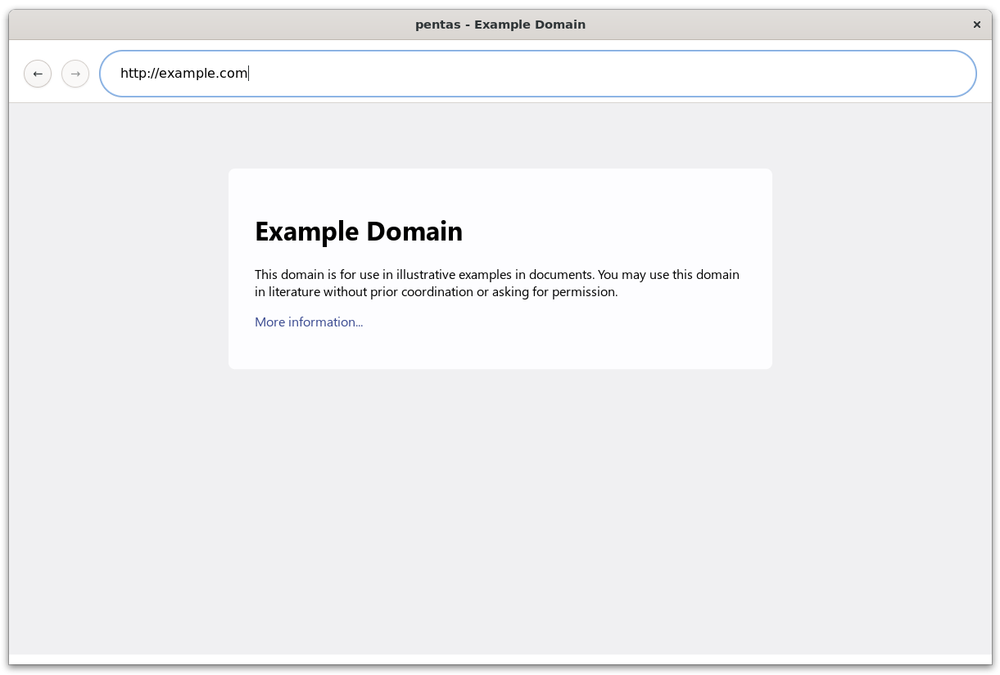

# pentas

pentas is a small browser built from scratch for educational purposes. Its core functionality is implemented without relying on external libraries, except for the GUI, which uses [gtk4](https://docs.gtk.org/gtk4/).

While this is just a toy program and not intended for practical use, it loosely adheres to web standards.



## Install

### Linux (Debian)

```shell
sudo apt install libgtk-4-dev build-essential
```

### Mac

```shell
brew install gtk4
```

For more detailed instructions, see [here](https://gtk-rs.org/gtk4-rs/stable/latest/book/installation.html).

## Usage

```text
$ cargo run -- -h
Usage: pentas [OPTIONS]

Options:
      --no-window-html <HTML>  The HTML file to parse in CLI mode
      --no-window-css <CSS>    The CSS file to parse in CLI mode
  -t, --tree-trace <LEVEL>     The verbosity level of the tree trace [default: silent] [possible values: silent, normal, debug]
  -h, --help                   Print help
  -V, --version                Print version
```

### Example

To open the browser window:

```shell
cargo run
```

To see how an HTML file is converted into a box tree (no window):

```shell
cargo run -- --no-window-html <HTML file>
```

To see how a CSS file is converted into a style sheet (no window):

```shell
cargo run -- --no-window-css <CSS file>
```
