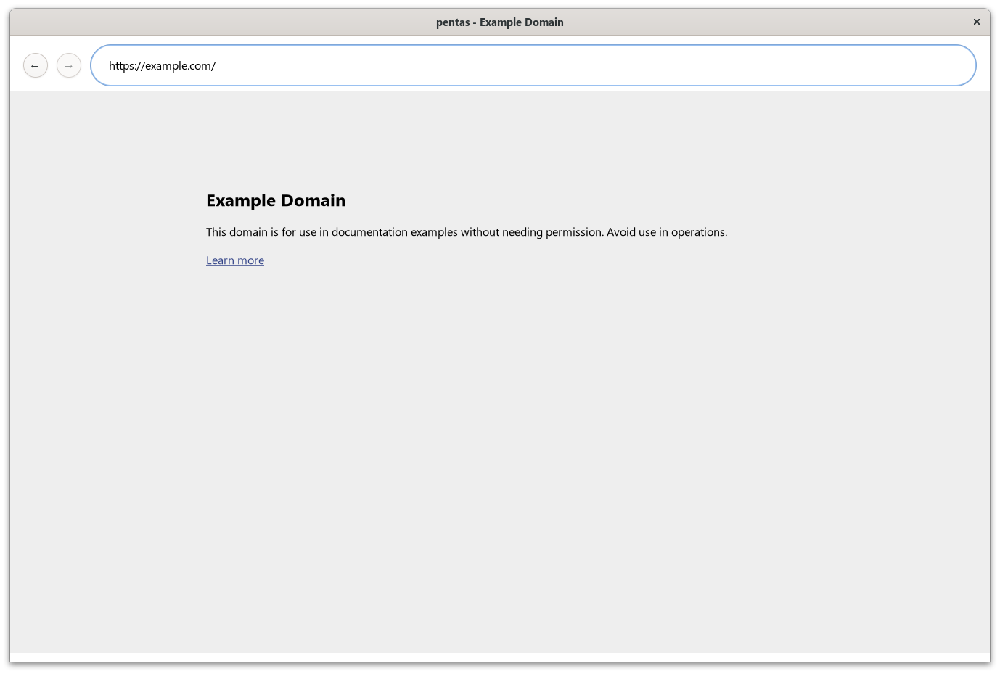
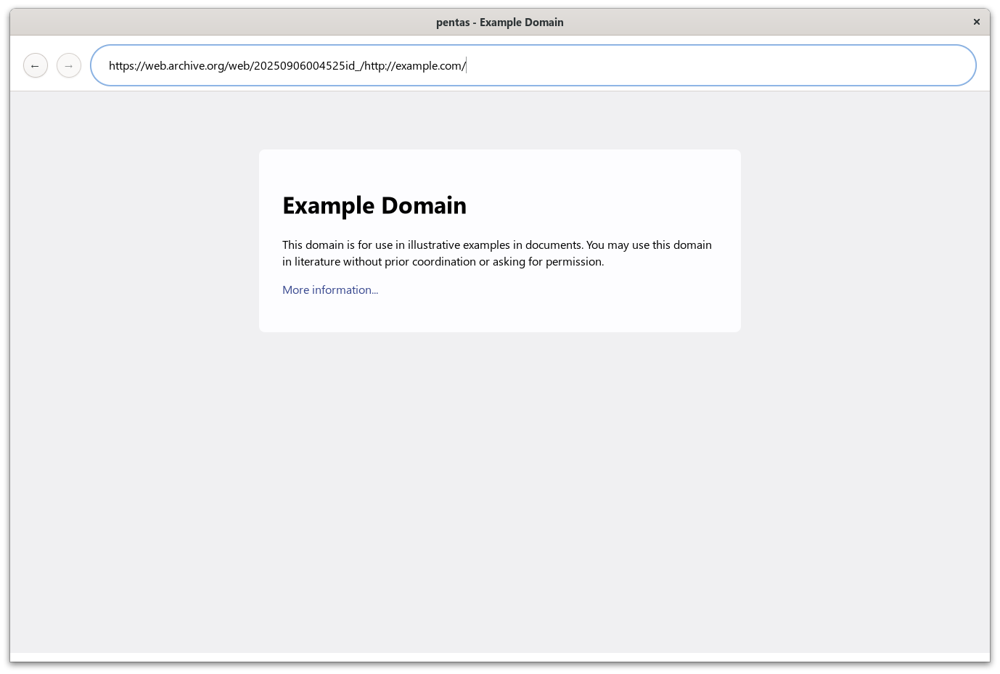

# pentas

pentas is a small, educational web browser built from scratch, designed to demonstrate how a browser works with as few dependencies as possible.





## Installation

The GUI requires GTK4.

### Linux (Debian)

```shell
sudo apt install libgtk-4-dev
```

### macOS

```shell
brew install gtk4
```

## Usage

```text
$ cargo run -- -h
Usage: pentas [OPTIONS] [COMMAND]

Commands:
  headless
  help      Print this message or the help of the given subcommand(s)

Options:
      --window-size <WIDTH,HEIGHT>  Initial window size [default: 1200 800]
  -d, --dump <LEVEL>                Dump level [default: off] [possible values: off, all, debug]
  -h, --help                        Print help
  -V, --version                     Print version
```

```text
$ cargo run -- headless -h
Usage: pentas headless [OPTIONS] [URL]

Arguments:
  [URL]  Target URL to process

Options:
      --local-html <HTML>           A local HTML file to parse
      --local-css <CSS>             A local CSS file to parse
      --window-size <WIDTH,HEIGHT>  Initial window size [default: 1200 800]
  -d, --dump <LEVEL>                Dump level [default: off] [possible values: off, all, debug]
  -h, --help                        Print help
```

### Example

Run with a GUI window:

```shell
cargo run
```

Run in headless mode:

```shell
cargo run headless https://example.com/ --window-size 1500,1000 -d all
```
